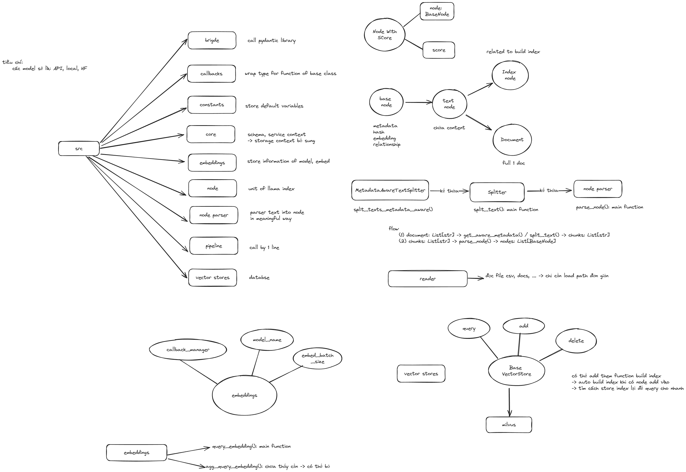

# backendDB




## Preparation
### Setup Environment
```
conda create -n backend python==3.10 -y
conda activate backend
pip install -r requirements.txt
```
### Setup Milvus server

#### Requirement
Milvus server run on Docker server, please see these following links first:
1. https://docs.docker.com/engine/install/
2. https://milvus.io/docs/prerequisite-docker.md

#### Install Milvus
Download milvus-standalone-docker-compose.yml and save it as docker-compose.yml manually, or with the following command:
```
wget https://github.com/milvus-io/milvus/releases/download/v2.3.2/milvus-standalone-docker-compose.yml -O docker-compose.yml
```
#### Start Milvus
In the same directory as the docker-compose.yml file, start up Milvus by running:
```
sudo docker-compose up -d
```

Now check if same directory as the docker-compose.yml file has folder volumes, and run the following command:
```
sudo docker compose ps
```
Connect to Milvus through port:
```
docker port milvus-standalone 19530/tcp
```

## Test splitter
Open file `notebooks/test_splitter.ipynb` and select kernel (`backend` environment). Then, feel free to test 🦙

Some arguement need to test:
1. `separator`: str = " ",
2. `chunk_size`: int = 200,
4. `chunk_overlap`: int = 20,
5. `paragraph_separator`: str = "\n\n\n",
6. `secondary_chunking_regex`: str = "[^.。？！]+[.。？！]?"
